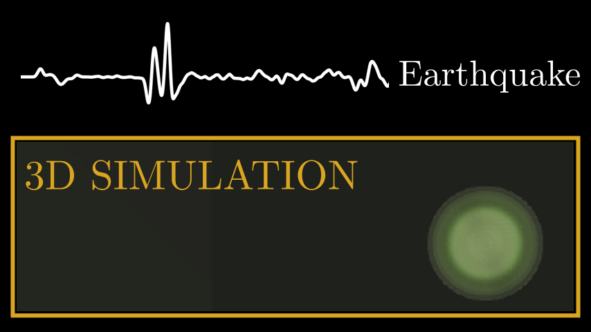

# earthquake.cpp

3D earthquake wave simulation in C++. Python required for visualization only (use requirements.txt to install dependencies). 

> Tested on Ubuntu 22.04.2 LTS using g++ compiler. I'm not using any fancy C++ features (only used classes), so it should work fine on other systems as well (but, don't blame me if it doesn't)

**YouTube Video:** https://www.youtube.com/watch?v=6kHhLTdwOR4

**Blog Post:** https://0mean1sigma.com/mi3d-earthquake-simulation/

## Drivers

1. **1D simulation:** Execute `make 1d_sim` in the terminal. This will generate the executable file in `bin`, which can be called as follows: `./bin/sim_1d.out`.
2. **3D simulation on a simpler velocity model (saving full 4D solution):** Execute `make 3d_sim` in the terminal. This will generate the executable file in `bin`, which can be called as follows: `./bin/sim_3d.out`.
3. **3D simulation on a simpler velocity model (saving a couple of 3D slices only):** Execute `make 3d_sim_slices` in the terminal. This will generate the executable file in `bin`, which can be called as follows: `./bin/sim_3d_slices.out`.
4. **3D simulation on a complex velocity model (saving a couple of 3D slices only):** Execute `make 3d_sim_slices_comples` in the terminal. This will generate the executable file in `bin`, which can be called as follows: `./bin/sim_3d_slices_complex.out`.

## Visualization

Visualization code in `viz` uses matplotlib and pyplot.

1. `view_viz_1d.py`: Visualizing 1D simulation using matplotlib.
2. `view_viz_3d.py`: Visualizing 3D simulation (full) using matplotlib.
3. `view_viz_3d_slices.py`: Visualizing 3D simulation (slices) using matplotlib.
4. `animGen_viz_3d.py`: Generates 3D simulation (full) using pyplot and saves it as mp4.